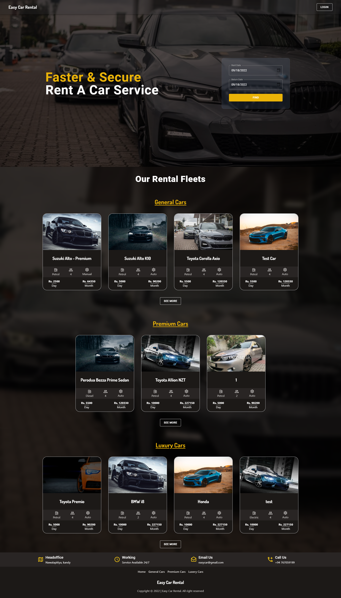
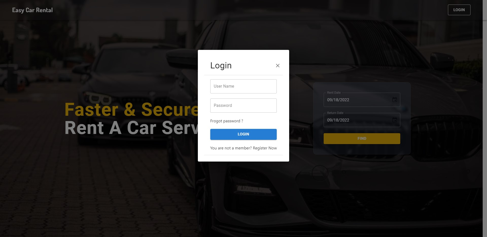
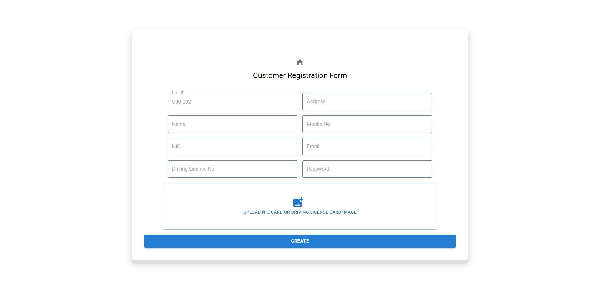
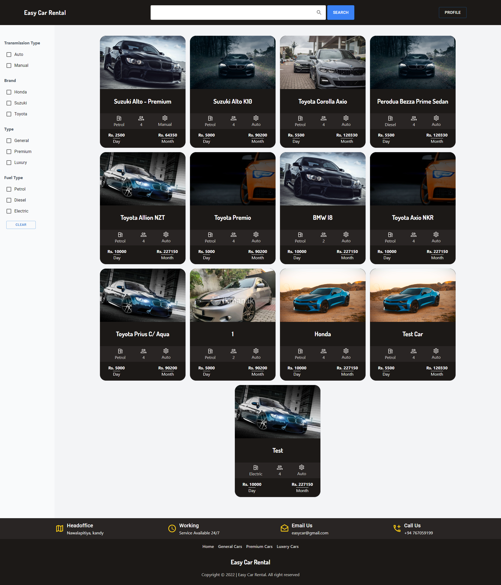
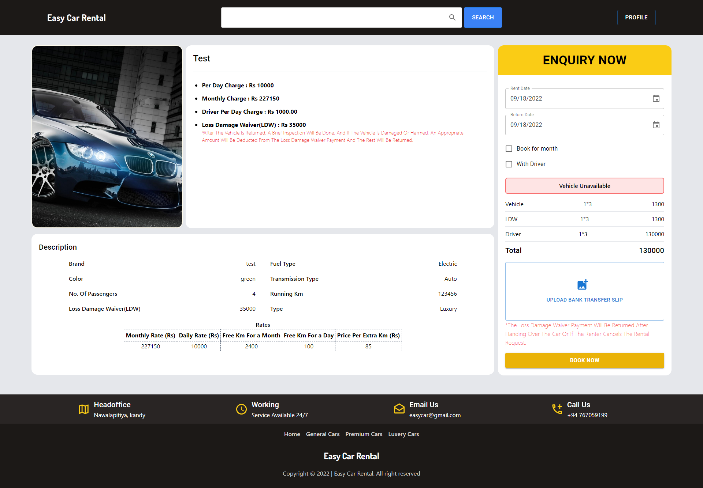
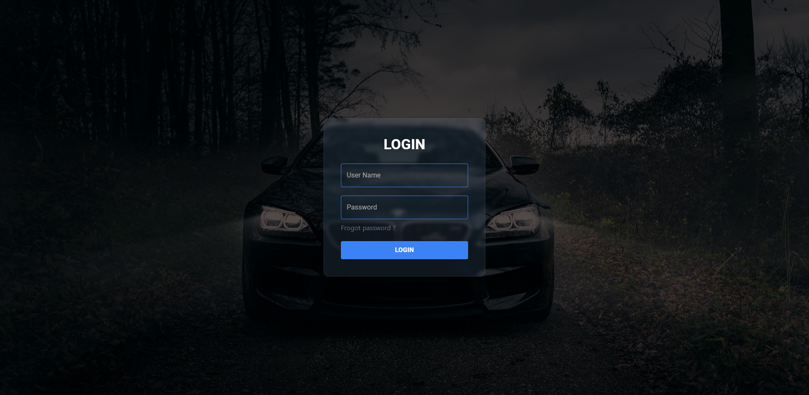
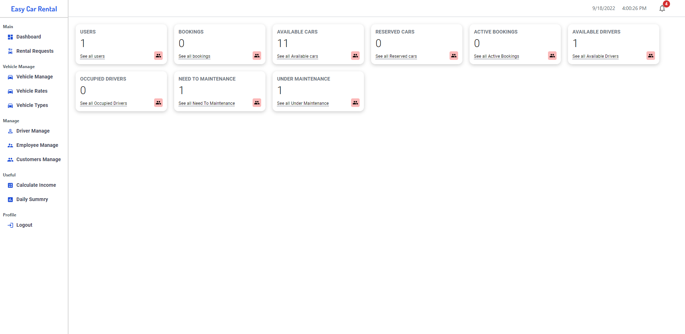
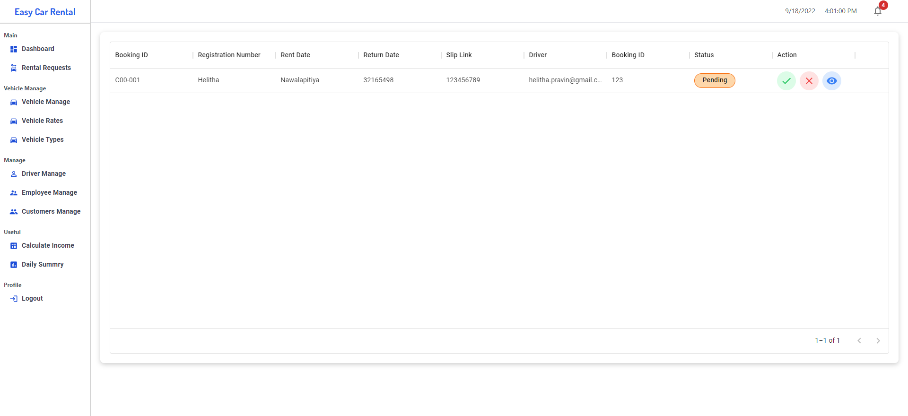
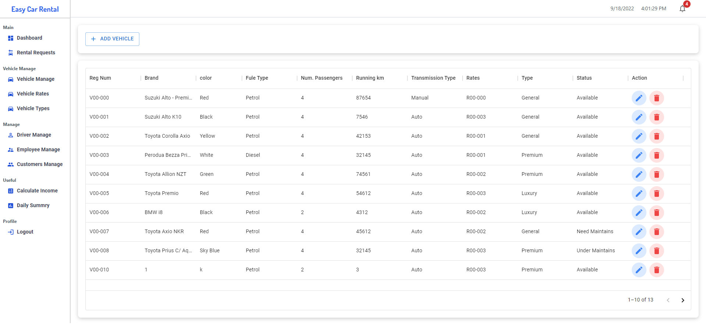

# Easy Car Rental System
### This project's objective is to make a system for a car rental place. A car rental owner wants to change their system online. He expects a software solution for that. Therefore, this project demonstrates how to do that task. The owner can manage everything in this system.
## Tools & Technologies
* Spring MVC
* React JS
* Tailwind CSS
* Material UI

